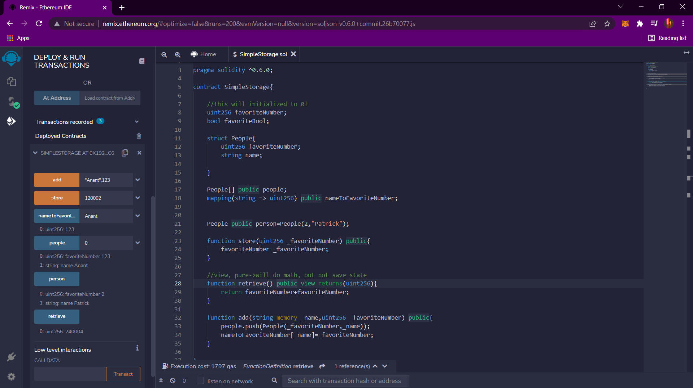
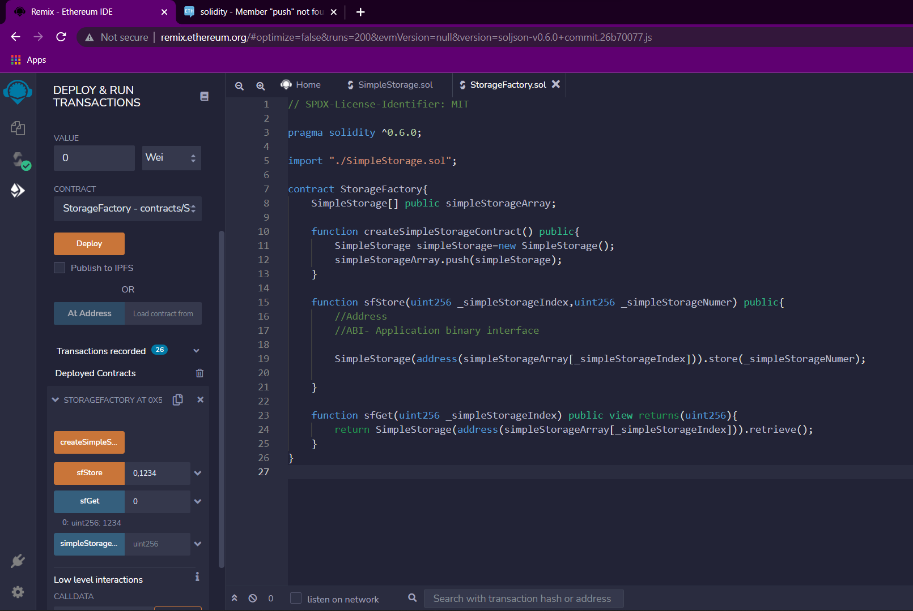
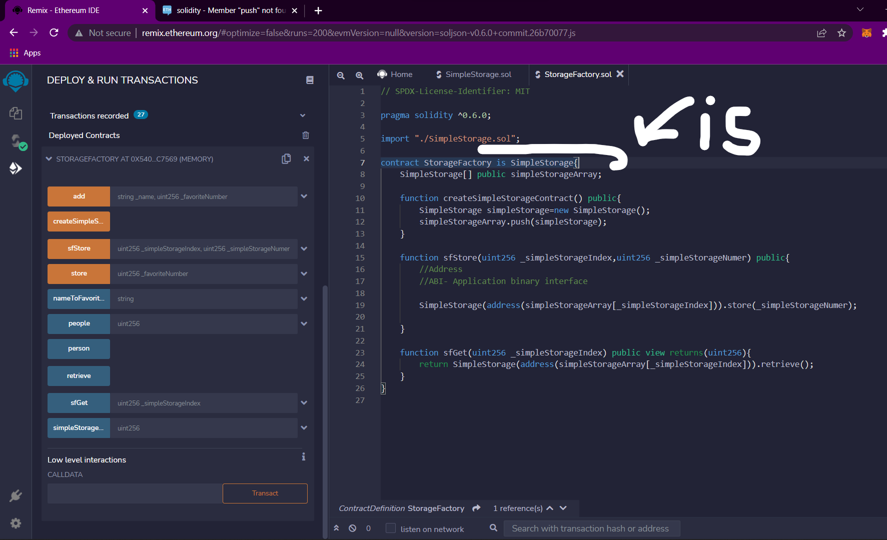
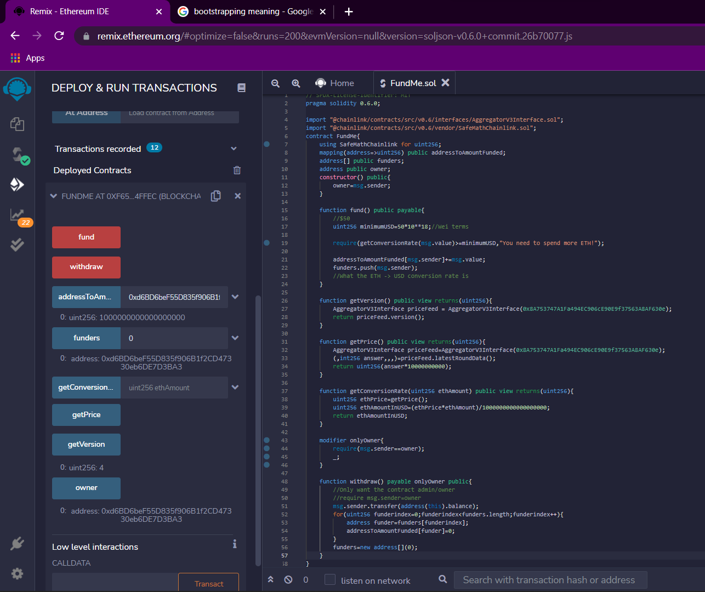

# Blockchain-Developement-practise

## 1. Simple Smart Contract .
> *Deployed in jvm and also in injected web3 using rinkeby test net*
>> 
>>> *Use firefox or change https to http in chrome*

## 2. Importing other Contracts .
> *To use other contracts functions we need address of that contract*\
>> *Then you can call that contract's functions using its address*
>>> 

## 3. Inheriting other Contract .
> *To inherit a contract use **is** keyword when declaring a contract*
>> Syntax
>>> `contract <ChildContractName> is <ParentContractName> { ... }`
>>>> 

## 4. Interfaces in Solidity and a Fund & Withdraw app
>**Chainlink provides decentralised API support in solidity**
> *Interfaces are declared using "interface" keyword instead of "contract" keyword*
>> *Interface provide minimalistic view of a contract*
>>> *Here we have used AggregatorV3Interface.sol interface to get pricefeed contract*
>>>> *To get pricefeed contract we used its Rinkeby Testnet address*
>>>>>**AggregatorV3Interface priceFeed = AggregatorV3Interface(0x8A753747A1Fa494EC906cE90E9f37563A8AF630e);**

> **Making an ETH to USD conversion and Fund Payment App**

    mapping(address=>uint256) public addressToAmountFunded;
    function fund() public payable{
        //$50
        addressToAmountFunded[msg.sender]+=msg.value;
        //What the ETH -> USD conversion rate is
    }
    
> ***"msg"* contains information about the payment done**
>> ***"msg.sender"* gives the address of the sender**
>> ***"msg.value"* gives the amount of ethers sent**
>
>> *Solidity has no concept of decimals*
>> 
> **Getting The latest ETH price in USD**
>>**We can use chainlinks price feed interface's latestRoundData function**

    function getPrice() public view returns(uint256){
        AggregatorV3Interface priceFeed=AggregatorV3Interface(0x8A753747A1Fa494EC906cE90E9f37563A8AF630e);
        (,int256 answer,,,)=priceFeed.latestRoundData();
        return uint256(answer*10000000000);
    }
>> **Multiplied by 10^10 to get the value in Wei**
>
>  **ETH to USD conversion function**

    function getConversionRate(uint256 ethAmount) public view returns(uint256){
        uint256 ethPrice=getPrice();
        uint256 ethAmountInUSD=(ethPrice*ethAmount)/1000000000000000000;
        return ethAmountInUSD;
    }
>
>  **Setting the threshold Amount**
>> *Now that we have our conversion and fund acceptor set-up, now we can check if the fund is equal to or above the threshold value using the **"require"** function*

    function fund() public payable{
        //$50
        uint256 minimumUSD=50*10**18;//Wei terms
        require(getConversionRate(msg.value)>=minimumUSD,"You need to spend more ETH!");
    }
>>*Now whenever the amount is less than our minimumUSD then the transaction will fail with an error "You need to spend more ETH"*
>
>**Now Lets make a withdraw function so that user can withdraw the amount that they've funded**\
>**Also we need a modifier so that we can check if the msg.sender is the owner itself.... for security reasons**
>**We will need a constructor to set the owner as soon as the contract is initialised**

    address public owner;
    
    constructor() public{
        owner=msg.sender;
    }
    
    modifier onlyOwner{
        require(msg.sender==owner);
        _;
    }
    
    function withdraw() payable onlyOwner public{
        //Only want the contract admin/owner
        //require msg.sender=owner
        msg.sender.transfer(address(this).balance);
    }
>**After withdraw we need to reset the funder amount**

    address[] public funders;
    //in fund function after adding to mapping
    funders.push(msg.sender);
    
    //in the withdraw function after transferring amount to sender
    
    for(uint256 funderindex=0;funderindex<funders.length;funderindex++){
            address funder=funders[funderindex];
            addressToAmountFunded[funder]=0;
    }
    funders=new address;
>>

## 5. Working in VSCODE, Python, Solidity, Web3, Ganache....
>**Opening .sol file in python script**

    with open("./SimpleStorage.sol", "r") as file:
        simple_storage_file = file.read()
        print(simple_storage_file)

>**Install py-solc-x -> Solidity Compiler**
    
    pip install py-solc-x
>**Use solcx in your project**

    from solcx import compile_standard, install_solc
    install_solc("0.6.0")
>**Compile and store the compiled file in a variable**

    compiled_sol = compile_standard(
        {
            "language": "Solidity",
            "sources": {"SimpleStorage.sol": {"content": simple_storage_file}},
            "settings": {
                "outputSelection": {
                    "*": {"*": ["abi", "metadata", "evm.bytecode", "evm.sourceMap"]}
                }
            },
        },
        solc_version="0.6.0",
    )
 
>**Get the bytecode and ABI from the compiled code**

    #get bytcode
    bytecode= compiled_sol["contracts"]["SimpleStorage.sol"]["SimpleStorage"]["evm"]["bytecode"]["object"]

    #get abi
    abi=compiled_sol["contracts"]["SimpleStorage.sol"]["SimpleStorage"]["abi"]

>**To deploy to local virtual machine we need a local blockchain -> Ganache**
>**install ganache from their website**
>**Now we need Web3.py**

    pip install web3
    
 *If It gives some error then download microsoft visual studio build tools*
>**Import web3 in python script**

    from web3 import Web3
>**Grab an address of a blockchain from Ganache and its private key, and store them here**

    #for connecting to ganache
    w3=Web3(Web3.HTTPProvider("http://127.0.0.1:7545"))
    chain_id=1337
    my_address="0x846CbacAe5508216708edcFb9E3ebBF9Bb0F87F3"
    private_key="0x8548f28e1c76bca843d3d95a259597079a78f65e1402c2dcb0edbb3f788472a2"
>**Now create the contract in python**

    #Create the contract in python
    SimpleStorage=w3.eth.contract(abi=abi,bytecode=bytecode)
>**Now get the number of transactions till now**
   
    #Get the latest transaction
    nonce=w3.eth.getTransactionCount(my_address)
> **Now we have to**
>
>>**Build the Transaction**
    
    transaction=SimpleStorage.constructor().buildTransaction({"gasPrice":w3.eth.gas_price,"chainId":chain_id,"from": my_address, "nonce":nonce})
>
>> **Sign the transaction**

    signed_txn=w3.eth.account.sign_transaction(transaction,private_key=private_key)
>
>> **Send the transaction**
    
    tx_hash=w3.eth.send_raw_transaction(signed_txn.rawTransaction)

