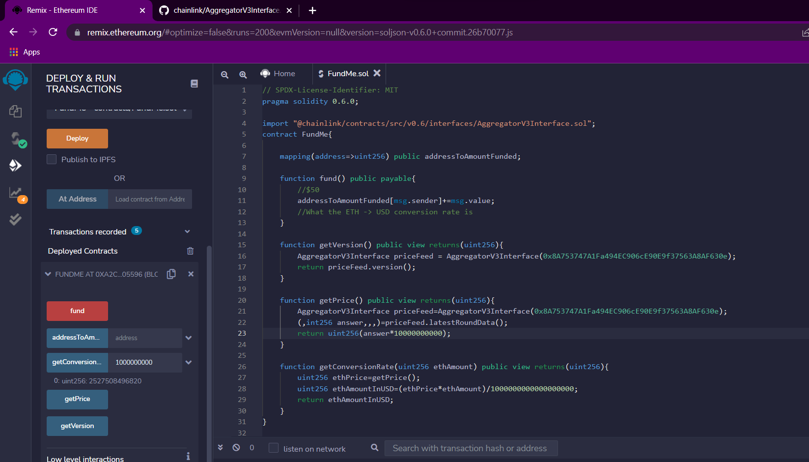

# Blockchain-Developement-practise

## 1. Simple Smart Contract .
> *Deployed in jvm and also in injected web3 using rinkeby test net*
>> 
>>> *Use firefox or change https to http in chrome*

## 2. Importing other Contracts .
> *To use other contracts functions we need address of that contract*\
>> *Then you can call that contract's functions using its address*
>>> 

## 3. Inheriting other Contract .
> *To inherit a contract use **is** keyword when declaring a contract*
>> Syntax
>>> `contract <ChildContractName> is <ParentContractName> { ... }`
>>>> 

## 4. Interfaces in Solidity
>**Chainlink provides decentralised API support in solidity**
> *Interfaces are declared using "interface" keyword instead of "contract" keyword*
>> *Interface provide minimalistic view of a contract*
>>> *Here we have used AggregatorV3Interface.sol interface to get pricefeed contract*
>>>> *To get pricefeed contract we used its Rinkeby Testnet address*
>>>>>**AggregatorV3Interface priceFeed = AggregatorV3Interface(0x8A753747A1Fa494EC906cE90E9f37563A8AF630e);**

> **Making an ETH to USD conversion and Fund Payment App**

    mapping(address=>uint256) public addressToAmountFunded;
    function fund() public payable{
        //$50
        addressToAmountFunded[msg.sender]+=msg.value;
        //What the ETH -> USD conversion rate is
    }
    
> ***"msg"* contains information about the payment done**
>> ***"msg.sender"* gives the address of the sender**
>> ***"msg.value"* gives the amount of ethers sent**
>
>> *Solidity has no concept of decimals*
>> 
> **Getting The latest ETH price in USD**
>>**We can use chainlinks price feed interface's latestRoundData function**

    function getPrice() public view returns(uint256){
        AggregatorV3Interface priceFeed=AggregatorV3Interface(0x8A753747A1Fa494EC906cE90E9f37563A8AF630e);
        (,int256 answer,,,)=priceFeed.latestRoundData();
        return uint256(answer*10000000000);
    }
>> **Multiplied by 10^10 to get the value in Wei**
>
>  **ETH to USD conversion function**

    function getConversionRate(uint256 ethAmount) public view returns(uint256){
        uint256 ethPrice=getPrice();
        uint256 ethAmountInUSD=(ethPrice*ethAmount)/1000000000000000000;
        return ethAmountInUSD;
    }
>> 

